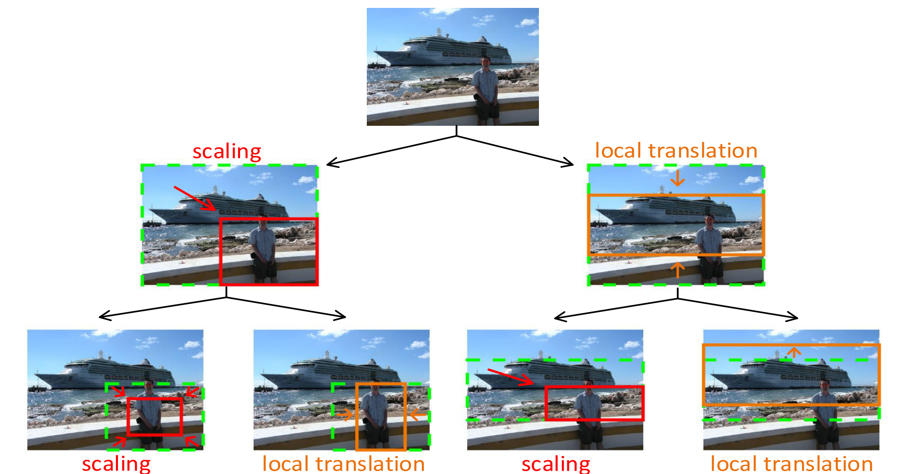
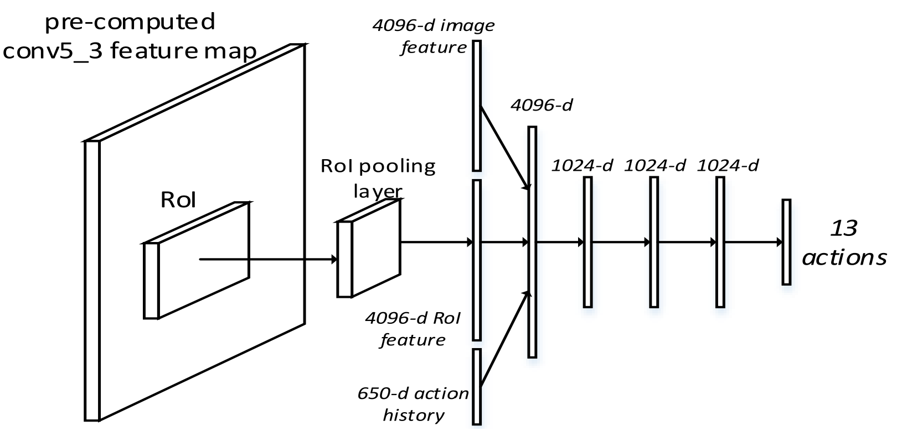
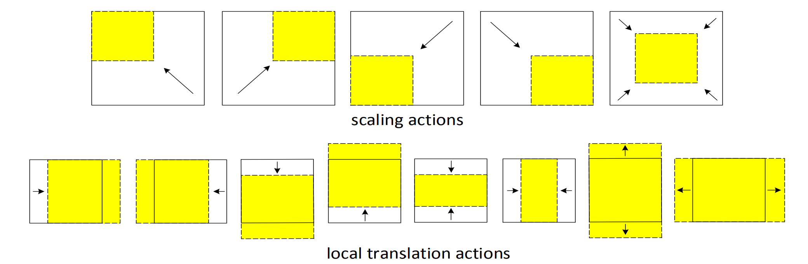
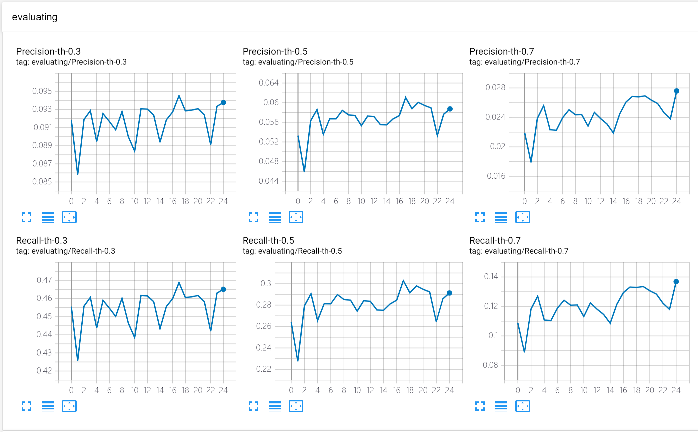
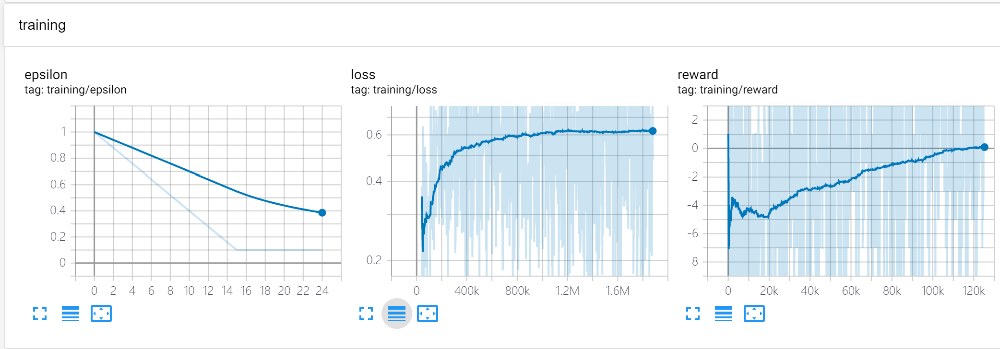
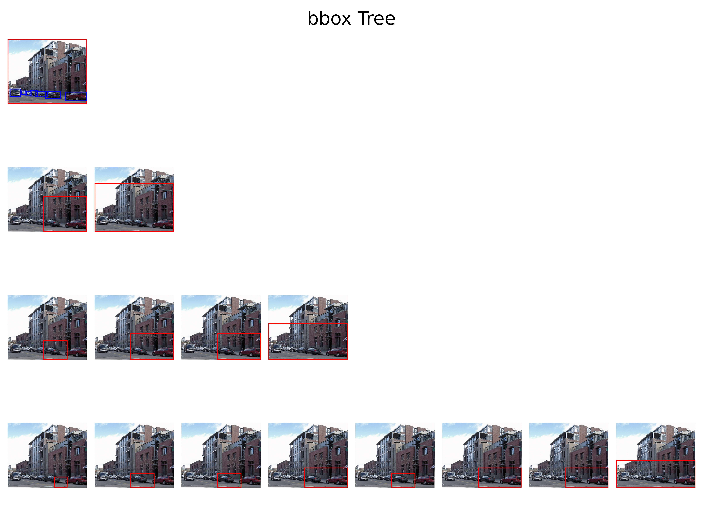
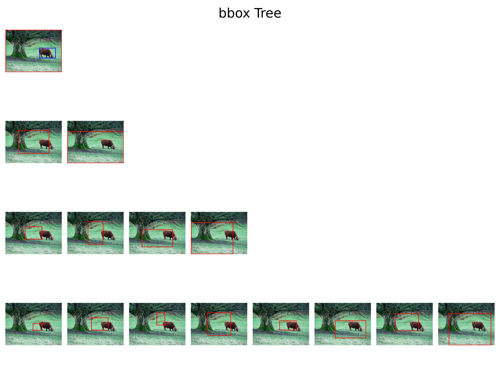
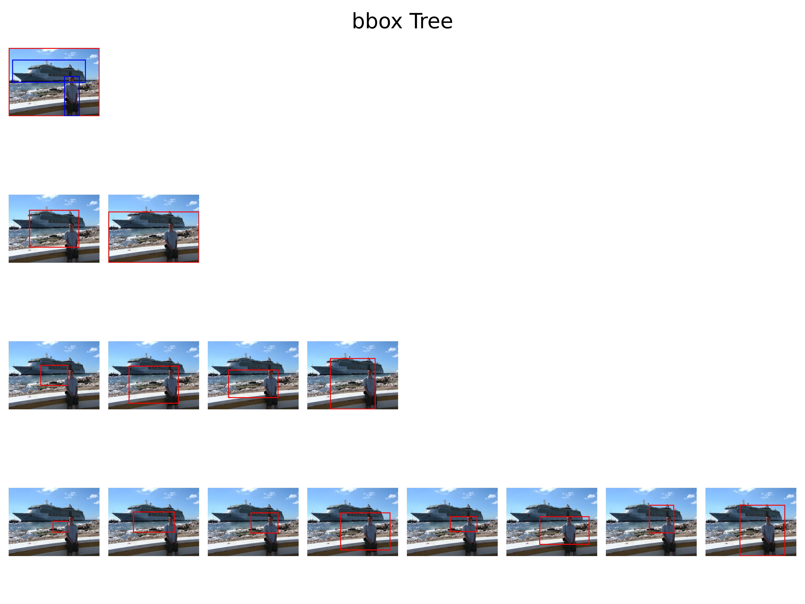
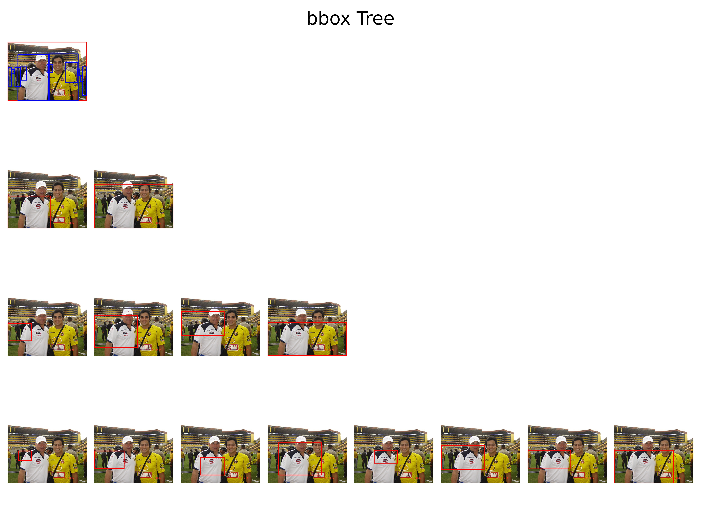

# Localize DQN

> Warning: Not official code, not achieving promising results yet and somewhat slow

### Help wanted! Any suggestion would be really appreciated.

> Issue or Contact me directly by yhshi@bupt.edu.cn

1. This repo attempts to reproduce [Tree-Structured Reinforcement Learning for Sequential Object Localization](https://papers.nips.cc/paper/6532-tree-structured-reinforcement-learning-for-sequential-object-localization.pdf) with pytorch 1.4.0.

    * Requirements(higher or lower versions might also work well)
        * pytorch 1.4.0
        * numpy 1.18.1
        * Prefetch version of DataLoader: https://github.com/IgorSusmelj/pytorch-styleguide/issues/5
        * PIL 7.1.2
        * matplotlib 3.2.1
        * tensorboard 2.1.0
        
    * Branches
        * **main**: (Try this first)
            * basic code 
            * load images from disk
            * fix ratio to 1:1 and image size to (224, 224)
            * support voc2007 and voc2012 combined dataset: training on 07+12 trainval(~16000 pics), testing on 07 test(~5000 pics)
            
        * **faster**: 
           * pre-extracted feature map to speed up
           * support loading all feature map to memory
           * keep original ratio and resize longest edge to defined size (eg. 500)
           * support voc2007 only: training on 07 trainval(~5000 pics), testing on 07 test(~5000 pics)
           
    * Usage
        * training
            * `mkdir model_params`
            * change settings by `set_args()` and global variables
            * `python train.py`
            
        * evaluating
            * eg. `python evaluate.py --model_name debug --model_check_point epoch_x_iter_x.pth.tar`
            * `result.json` will save to `./model_params/debug`
            
        * visualizing
            * eg. `python visualize_tree.py --json_path ./model_params/debug/results.json --vis_dir vis --num_images 50`
            * `./model_params/debug/vis` will be created and stores bbox-tree pictures
            
        * extracting
            * eg. `python preprocess.py --year 2007 --image_set trainval --max_size 500`
            * see `preprocess.py` in branch **faster** for more details
    
    * Dataset
        * `torchvision.datasets.VOCDetection` support downloading VOC2007 and VOC2012 by change  `download=True`
        * Or `mkdir data` and follow the file structures shown below:
        ```
        data
        ├── feature_map_2007_trainval.h5
        ├── img_info_2007_trainval.pkl
        ├── voc2007
        │   └── VOCdevkit
        └── voc2012
            └── VOCdevkit
        ```

2. Overview of the model and search method from original paper:

    * Tree-RL
    
        
    
    * Q-Net: States
    
        
    
    * Actions
    
        
    
3. Major implementation difference between this repo and original paper: (For the sake of speed)

    * (ResNet50 + average pooling) instead of (VGG16 + flatten) is used in the feature map extractor. see `model/encoder.py`for more details.
    * Only 4 layers of the tree is generated (including the root node) during evaluate searching. 
    * Reduce action history in states from 50 to 3.*
    * Reduce maximum searching steps during training from 50 to 15.

      \* : In my opinion, since I adopt 4-layer tree which requires only 3 actions search from root to leaf, setting action history to larger size simply adds additional zeros to the input. 
           
 4. Results (based on Branch **faster**)
 
    * training speed: around 30 minutes per epoch
    
    * training curves:
        
        * P/R of test set
           
           
        * epsilon / loss / reward: smoothing=0.999
           
           
    * examples: from layer 0 to layer 3, blue bboxes are ground truth while red bboxes are predicted by agent modified based on this repo
        
        
        
        
        
        
 5. Problems(**Help wanted!**)
 
    * Huge gap between my implementation and original paper.
    * Loss is really hard to converge.
    * Reward seems improving slowly.
    * Visualization of bbox scaling and moving is not very convincing.
    * Scaled up dataset (07+12) shows little improvement to final performance but achieves 3x training time.
 